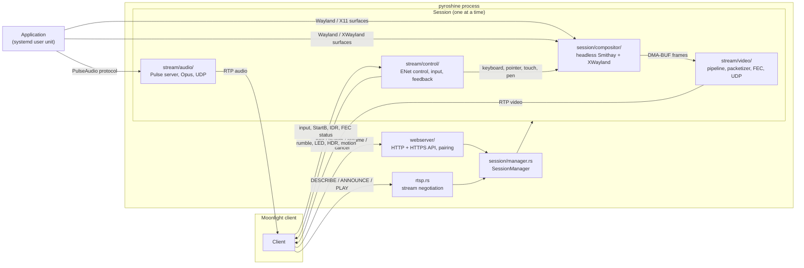
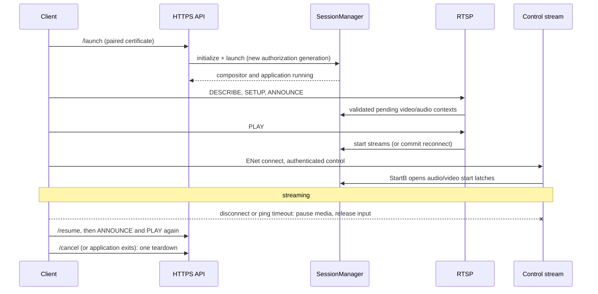

# Architecture overview

Pyroshine runs one application at a time in an isolated, headless Linux session
and streams its video, audio and input to a Moonlight-compatible client. This
document describes the current design: components, how they communicate, the
lifecycle from startup to shutdown, and the invariants changes must preserve.
Subsystem guides linked from each section hold the detailed contracts.

Build, install, CI and release procedures live in [CONTRIBUTING.md](../CONTRIBUTING.md).
User-facing configuration lives in [CONFIGURATION.md](CONFIGURATION.md).

## Workspace

| Crate | Output | Role |
| --- | --- | --- |
| Root `moonshine` (`src/main.rs`) | `moonshine` binary, installed as `pyroshine` | CLI, configuration loading, host checks, service wiring, process shutdown |
| `moonshine-core` | Library | Every server subsystem: protocol endpoints, pairing, sessions, compositor, encoders, transport, input |
| `moonshine-tools` | `moonshine-bench` | Developer benchmark that drives the production session stack without a client |
| `moonshine-management` | Library | Local management API contract: D-Bus names, JSON documents, error names and client proxies |
| `pyroshine-ui/` (separate workspace) | `pyroshine-ui` | Optional desktop app: tray, notifications, pairing, settings and dashboard |

Native dependencies cross explicit boundaries: Smithay (compositor), Pixelforge
(Vulkan Video encoding), the optional PyroWave shared library (loaded at
runtime), the vendored Inputtino native backend (virtual input devices), and
systemd/logind over D-Bus. Internal crate names, paths, environment variables
and protocol identifiers keep the upstream `moonshine` spelling.

Core paths below are relative to `moonshine-core/src/`.

## Components and data flow



| Component | Responsibility | Does not own |
| --- | --- | --- |
| `src/main.rs` | Load config, scan applications, wait for the user D-Bus session, run host checks, construct services, handle SIGTERM/SIGINT | Session state |
| `config.rs`, `app_scanner/` | Deserialize `config.toml`; discover Steam, Lutris, Heroic and desktop-entry applications at startup | Runtime reconfiguration |
| `healthcheck.rs`, `gpu.rs` | Probe GPU, Vulkan, DMA-BUF and encoder profiles; verify the capture and encode devices are the same GPU | Encoding |
| `discovery.rs` | Advertise `_nvstream._tcp` over mDNS | — |
| `tls.rs`, `clients.rs`, `state.rs`, `durable.rs` | Server identity, paired-client trust, durable `state.toml` | Session authorization |
| `webserver/` | GameStream HTTP/HTTPS API: server info, app list, pairing, launch/resume/cancel, PyroWave bandwidth probe | Stream properties |
| `rtsp.rs` | RTSP OPTIONS/DESCRIBE/SETUP/ANNOUNCE/PLAY; parse and validate negotiated stream contexts | Encoders or sockets |
| `ingress.rs` | Bounded, cancellable tasks for accepted HTTP, HTTPS and RTSP connections | Protocol semantics |
| `session/manager.rs` | The single session's lifecycle, transitions, authorization generations, keys and teardown | Resource creation details |
| `session/mod.rs` (`SystemSession`) | Builds the compositor, application and streams for each transition | Lifecycle decisions |
| `session/application.rs` | Run the application, pre/post commands and output routing as the `moonshine-session.service` systemd user unit | — |
| `session/compositor/` | Wayland/XWayland server, scene, focus, cursor, Steam classification, output mode, capture and frame export | Codec negotiation, transport |
| `session/stream/video/` | Import, convert and encode captured frames; packetize, protect, encrypt, pace and send | Scene composition |
| `session/stream/audio/` | PulseAudio-compatible capture server, Opus encoding, FEC, encryption and UDP | — |
| `session/stream/control/` | ENet control channel, peer authorization, input decoding and routing, virtual controllers, client feedback | Wayland focus |
| `management/` | Session-bus management interface: status, pairing, clients, configuration store, telemetry aggregation | Session, pairing or trust decisions (it calls the owners) |
| `session/status.rs` | Public session phase from manager status and control-stream ownership | Lifecycle transitions |

Boundaries to preserve:

- Scene visibility and input focus belong to the compositor. Encoding, packet
  transport and FEC belong to `stream/video/`. Control decoding and virtual
  devices belong to `stream/control/`.
- Surface presentation and native color descriptions belong to the compositor;
  frames carry their declared encoding to the video pipeline.
- Developer tools reuse the production session interfaces through
  `SessionManager`; they do not own a parallel stack.

## Process and threading model

The server is a multi-threaded Tokio process. Latency-sensitive or blocking work
runs on dedicated threads that communicate through bounded channels:

| Thread or task | Work |
| --- | --- |
| `compositor` thread | calloop event loop: Wayland dispatch, XWayland, input injection, refresh timer, scene capture |
| `video-pipeline` thread | DMA-BUF import, conversion and encoding (Pixelforge or PyroWave) |
| Video packet task | Packetization, FEC, encryption, pacing and UDP send |
| `pulse-server` thread | PulseAudio protocol server for the application |
| `audio-encode` thread and audio packet task | Opus encoding, audio FEC/encryption and UDP send |
| Control task | ENet service loop, message decoding, input routing, feedback |
| `gamepad-input` thread | Inputtino virtual controller state and native feedback callbacks |
| Manager-owned tasks | Session transitions and teardown |

Every session worker registers a `lifecycle::WorkerGuard` before it is spawned,
so session completion means every worker has exited and released what it owns.

## Startup and capability advertisement

`src/main.rs` loads or creates the configuration, scans applications, waits for
the user D-Bus session, then runs the health check. `pyroshine healthcheck`
runs the same checks and exits. `--no-health-check` skips the report but still
probes GPU capabilities, and the server refuses to start without DMA-BUF import.

Advertised codecs and HDR come from encoder and profile probes, not from finding
a library or extension name:

- `gpu.rs` verifies the selected Vulkan device matches the GBM/EGL render node
  used for capture (`VK_EXT_physical_device_drm`, with the complete PCI address
  as a fallback). An unresolvable or mismatched identity advertises no codec,
  HDR or DMA-BUF capability and prevents launch. No cross-device
  capture-to-encode path exists.
- The compositor publishes the verified, shared `VideoContext` before it reports
  ready. Conventional encoding, DMA-BUF import and PyroWave device matching use
  that context for the whole session, including reconnects.
- A conventional codec bit is set only after creating its exact Pixelforge
  profile. PyroWave bits are set only after loading the pinned C API, matching
  the Vulkan device and creating each SDR/HDR encoder. A missing or incompatible
  PyroWave library leaves the conventional codecs available.

The server then constructs, in order, TLS identity, `SessionManager`,
`ClientManager`, the management service, the RTSP server, the webserver and
mDNS discovery, and waits for a shutdown signal. The management service is
optional: failing to connect to the session bus or to own its name is logged
and the server runs unchanged.

## Client lifecycle



1. **Discovery and pairing.** Clients find the host through mDNS or manually.
   Pairing is approved by the host operator in the desktop app or on the
   loopback-only `/pin` page; trust is persisted in `state.toml` before it is
   published. See [Security administration](SECURITY_ADMINISTRATION.md).
2. **Launch.** An authenticated HTTPS `/launch` validates the request, creates an
   authorization generation and session keys, then initializes and launches the
   session: the compositor starts (with XWayland), and the application starts as
   a systemd user unit with `WAYLAND_DISPLAY`, `DISPLAY` and `PULSE_SERVER`.
3. **Negotiation.** RTSP DESCRIBE advertises the probed formats. ANNOUNCE carries
   the client's codec, chroma, dynamic range, resolution, FPS, bitrate, packet
   size, encryption and audio layout; it is validated and stored as a *pending*
   context. PLAY commits it by starting the stream workers.
4. **Streaming.** The control stream admits the authenticated peer. Its `StartB`
   opens the video and audio start latches, and media flows.
5. **Disconnect and resume.** Losing the control peer (ENet disconnect or the
   `[stream].timeout` ping deadline) pauses media delivery and releases its
   input, but keeps the application running. `/resume` starts a new
   authorization generation; the following ANNOUNCE and PLAY either fast-resume
   unchanged settings or reconfigure.
6. **Stop.** `/cancel`, application exit, a worker failure, a failed transition
   or service shutdown starts exactly one teardown.

## Session lifecycle and negotiation

`session/manager.rs` owns the single optional session; `session/mod.rs` builds
its `Initialized`, `Launched` and `Active` states. Application and compositor
lifetime is separate from a client's *stream epoch*: a reconnect can keep the
application while resetting or replacing encoders and transport state.

| Step | Owner and contract |
| --- | --- |
| HTTP launch | Authenticated GameStream API initializes and launches the application and compositor |
| RTSP ANNOUNCE | Validates negotiated formats and numeric domains; for an active session, pauses the live epoch, then publishes pending video/audio contexts |
| RTSP PLAY | After checking every prerequisite, constructs initial streams or commits a reconnect transition. The first PLAY applies the ANNOUNCE output mode (resolution, refresh rate, HDR) to the running compositor before starting streams, or fails; the session context then reports the negotiated mode, as after a reconnect |
| Control `StartB` | Opens the persistent audio/video start latches; tools open the same latches through the manager |
| HTTP resume | Validates and publishes session keys and retains requested session parameters; RTSP remains authoritative for encoded stream properties |
| Unchanged reconnect | Pauses both streams, keeps the video pipeline and Pulse sockets, resets client-visible sequencing and encoder state (IDR), and activates transport before PLAY completes |
| Changed reconnect | Pauses both epochs, reconfigures compositor output only for resolution, refresh rate or HDR changes, and commits new video/audio resources before activating delivery |
| Failed ANNOUNCE pause | One medium may already be paused and a worker no longer answers; the session is handed to teardown |
| Cancel, application exit or failure | One teardown stops the application unit and joins every worker; only then can a new launch start |

Negotiation invariants:

- **Pending is not active.** Keep pending and active contexts separate until
  PLAY. Epoch barriers ensure old frames and packets never enter a new stream.
- **Validate before changing anything.** Launch, resume and ANNOUNCE values are
  checked against shared numeric domains (`session/negotiation.rs`,
  `VideoStreamContext::validate`) before the manager pauses, rekeys or
  reconfigures. A rejected request leaves the working stream unchanged. The
  domains are consumer limits (representable extents, one-datagram shards,
  32-bit rate control, implemented audio durations), not quality caps.
- **No silent fallback.** An unsupported codec, chroma, bit depth or range fails
  negotiation; the server never substitutes another format.
- **Epochs belong to one generation.** PLAY snapshots its authorization
  generation and the keys published for it under the manager lock; the start
  request or reconnect plan carries that snapshot to every worker, and each new
  epoch (`BeginEpoch`) is activated for that generation. The video and audio
  senders deliver only after `StartB`, to an endpoint discovered by the active
  epoch's generation, while that generation is the current authorization. A
  `/resume` therefore ends delivery to the replaced client immediately, without
  waiting for ANNOUNCE, and interrupts a paced send in progress; a PING of the
  new generation discovers an endpoint but delivers nothing until its PLAY
  activates an epoch. A PLAY whose generation a newer `/resume` replaced while
  it reconfigured fails; the manager records the contexts the workers now run so
  the next reconnect is planned against reality.
- **Lifecycle commands do not wait for `StartB`.** The start latch gates
  capture, encoding and sending only. Pause, reset, reconfiguration and epoch
  activation are served before it, so a client that completed PLAY and
  disappeared before `StartB` can be resumed (unchanged or changed mode).
- **Audio follows the same barrier.** Every reconnect, including unchanged
  settings, runs Pause → producer reset → begin epoch for audio as for video.
  Opus and RTP/FEC state are recreated and Pulse discards queued PCM before
  activation. Pulse client connections survive; a layout change rebuilds output
  converters without closing application sockets.

Use the [reconnect validation](reconnect-validation.md) matrix for changes here.

### Authorization and keys

- Each authenticated `/launch` or `/resume` starts an **authorization
  generation** (`session/authorization.rs`): the paired client's normalized
  address plus fresh session identifiers. RTSP accepts only that address, and
  ANNOUNCE/PLAY commit only within the generation that issued them. RTSP
  possession alone never implies pairing authorization.
- Media PINGs must come from that address and, for clients announcing
  `ML_FF_SESSION_ID_V1`, echo the generation's ping payload; source ports may
  differ for NAT. A PING discovers an endpoint but cannot activate a paused epoch.
- The control stream (`stream/control/peers.rs`) admits candidates by address
  and connect data, but dispatches only the peer that authenticates with the
  HTTPS-delivered AES-GCM key. Only that active peer extends the stream timeout
  and receives feedback.
- Session keys (`session/keys.rs`) carry a server-owned generation; consumers
  detect changes by generation, never by the client's `rikeyid`. AES-GCM nonce
  counters for video and control belong to the key bytes through a
  process-lifetime ledger, so recreation, reconnect or a later session reusing
  the key continues the same counters. An encrypted video epoch encrypts every
  shard or emits none; nonce exhaustion retires the key. Audio uses the
  protocol's AES-CBC IV (`rikeyid` plus RTP sequence).

### Input ownership across reconnects

The authenticated controlling peer owns input. When it disconnects or its
generation is replaced, the control stream releases held keys and buttons,
cancels touch, pen and text input, neutralizes every virtual controller,
cancels pending Home/Guide timers and revokes the feedback route before the
cleanup is acknowledged.

Virtual controllers stay plugged in across ownership changes, so a retained game
does not observe an unplug. Native Inputtino callbacks hold an owner-switchable
route (`control/input/ownership.rs`), never a peer's channel; feedback produced
while unowned is dropped. The next peer's first input for a slot claims it and
replays LED and trigger-effect state (never rumble). A different controller
identity, a controller missing from the client's active mask, or teardown
destroys the device. A delayed disconnect from a replaced generation cannot
release the new owner's input.

## Session ownership and shutdown

The manager's lifecycle is explicit; absence of state never means idle:

| State | Meaning |
| --- | --- |
| `Idle` | No session and no owned resources. The only state that accepts `/launch`. |
| `Live` | A session record (epoch, stop manager, authoritative context, live stream contexts, application unit, start latches) plus either the owned state or one in-flight transition that checked it out. HTTP and RTSP see the context in both cases. |
| `Stopping` | One teardown task owns everything. The session is not reported; its keys, pending contexts and authorization are retired, and a replacement launch waits (bounded) for completion. |

**Transitions** (initialize, launch, PLAY start/resume, active ANNOUNCE pause)
validate every prerequisite under the manager mutex, then run in a
manager-owned task with the mutex released. An HTTP timeout or dropped RTSP
connection does not drop the work. Each transition holds its session's
completion token and runs under the session's cancellation, so a stop cancels
it at any await and teardown waits until it hands back what it checked out. A
result commits only if the session epoch and transition id are still current
and the session is not stopping. A failed transition never leaves half-applied
state: it starts a full teardown. Duplicate, premature or stale requests are
rejected without touching the retained application or streams.

**Workers** (compositor, video pipeline thread and packet task, audio encoder
and packet task, PulseAudio server, control stream, gamepad thread) register a
`lifecycle::WorkerGuard` before they are spawned and drop it last, after their
sockets, threads, GPU objects and frames. Stream workers produce and send media
only after `StartB`, through a persistent `lifecycle::StartLatch`: it may open
before, during or after workers wait, duplicate opens are no-ops, and a stop
before `StartB` cancels the wait and releases the worker's socket. While waiting
they keep serving pause, reset and reconfiguration commands.

**XWayland** is owned by the compositor (`compositor/xwayland_process.rs`),
which holds a pidfd for the child it spawned. Teardown closes its Wayland
client, waits (then `SIGKILL`s via the pidfd), and releases the display lock and
sockets before the compositor's worker guard drops. A surviving process keeps
the session `Stopping`. A retained-session reconnect does not touch XWayland.

**Teardown** has a single owner per session, started by user cancel, a worker or
application exit (through a per-session watchdog that only hands over), a failed
transition, or service shutdown. In order, it stops the application unit while
the compositor and audio still serve it (if a transition is in flight, that is
cancelled first and the unit is stopped after it hands back), triggers the
session stop, drops the owned state, waits for every worker and transition,
drops state handed back by transitions, then reports `Idle`. The
unit name is recorded before a launch starts, so a launch cancelled after
systemd accepted the unit is still stopped. `Application` drop never blocks;
stopping the unit is an awaited, bounded D-Bus job.

`Idle` requires established application termination: after the stop job,
systemd must report the unit unloaded, or inactive/failed with no process left
in its cgroup (a unit awaiting garbage collection counts as stopped). The stop
job's own result is not trusted on its own. The client waits as long as
systemd's stop policy allows (5 s SIGTERM allowance for the application and
again for `ExecStopPost` hooks, then SIGKILL; `application.rs` derives the
deadline and the manager uses it). If termination cannot be established, the
session follows the terminal teardown policy below instead of becoming idle.
A launch first stops a leftover unit of the same name and refuses to start
until it is unloaded.

**Deadlines.** Application stop is bounded to 15 s (`APPLICATION_STOP_DEADLINE`:
the 12 s stop-job wait plus the 2 s termination check and bus connection) and
worker exit to the rest of a 25 s end-to-end deadline
(`SESSION_TEARDOWN_DEADLINE`). Exceeding the deadline, or failing to establish
that the application terminated, is terminal: the session stays `Stopping`, new
sessions are refused, and the service shuts down for its supervisor to restart
it. Service shutdown (SIGTERM/SIGINT) completes
only after session teardown finishes or fails within the same deadline.

Tests: `session/manager/lifecycle_tests.rs` drives the manager through a fake
backend with barriers and fault injection at every transition await; stream
workers have socket-release tests in their modules.

## Compositor and presentation

`session/compositor/` embeds a headless Smithay compositor on its own calloop
thread. It owns:

- the Wayland display, XWayland, and the virtual output (mode, refresh rate,
  scale, HDR state);
- scene, stacking, focus and Steam window classification (`focus.rs`,
  `x11_focus.rs`), following Gamescope's Steam focus model;
- cursor state (`cursor.rs`) and output scaling (`scaling.rs`);
- native `wp_color_management_v1` surface descriptions and scene color draws
  (`color_management.rs`, `color_render.rs`);
- input injection into the Smithay seat (`input.rs`);
- capture and frame export (`capture.rs`, `admission.rs`, `frame.rs`).

The refresh timer is the only capture clock: each refresh deadline offers at
most one capture, independent of encoder completion. Buffer releases, frame
callbacks and input continue even while capture is blocked.

**Presentation.** Applications present through ordinary Wayland or X11 surfaces.
**Capture.** Capture visibility and input focus are separate decisions:

- *Direct export* hands the encoder the application's own DMA-BUF when it
  represents the entire visible scene, optionally with a cursor and Steam
  notification as late-composited layers.
- *Composition* renders the scene through GLES into a compositor-owned DMA-BUF
  pool and waits for completion before export.

Commits are latched only once their DMA-BUF has finished rendering, and color
descriptions and metadata (sRGB, BT.2020/PQ, scRGB) follow the captured source.
Direct PQ stays encoded; direct scRGB is converted by the encoder. Composition
normalizes HDR into PQ during the existing scene draw. XWayland without native
color declarations is SDR. See [native presentation](NATIVE_PRESENTATION.md). See
[Compositor](COMPOSITOR.md) for eligibility, cursor and Steam rules.

## Video path

```text
compositor capture ─ExportedFrame─▶ video-pipeline thread ─encoded frame─▶ packet task ─UDP─▶ client
   (admission credit)             import → convert/encode            packetize → FEC → encrypt → pace
```

**Admission.** `compositor/admission.rs` gives the consumer receiver-driven
demand: one credit and one handoff slot. The compositor claims the credit before
any export or rendering. Two signals are independent:

- **Capture admission** says whether the pipeline can accept another scene.
- **Buffer consumption** (`consumed`) says whether the GPU has finished reading
  the source.

Releasing a source buffer never creates a second admission credit, and paced
sending never retains a source buffer after GPU consumption. Every
`ExportedFrame` also holds a `SourceLease` (a strong DMA-BUF reference) so its
descriptors stay valid while queued, imported or read. Epoch changes reject old
completions without replenishing demand. See
[Capture pipeline](PIPELINE_OPTIMIZATION.md).

**Encoders.** `stream/video/format.rs` treats codec, chroma, bit depth,
transfer, primaries, matrix, range and HDR as independent negotiated properties.

| Backend | Formats | Path |
| --- | --- | --- |
| Pixelforge (`pipeline/mod.rs`, `pipeline/convert.rs`) | H.264, HEVC, AV1 via Vulkan Video | DMA-BUF import → compute conversion (with optional cursor/notification layers) → asynchronous encode with three bounded in-flight frames → HDR SEI/OBU metadata on keyframes (`pipeline/hdr_sei.rs`) |
| PyroWave (`pyrowave.rs`, `pyrowave_protocol.rs`) | Intra-only wavelet codec, 4:2:0/4:4:4, SDR/HDR10 | DMA-BUF import into a PyroWave-owned Vulkan device on the same GPU → GPU scale, color transform and encode → one frame at a time through send completion |

PyroWave is a separate codec (`bitStreamFormat` 3); it never impersonates a
conventional codec and has no CPU or alternate-codec fallback. `pyrowave.rs`
owns the C API's unsafe boundary: exact ABI checks, handle ownership, and
destroying child resources before the device and library. See
[PyroWave](PYROWAVE.md).

**Transport.** `packetizer.rs` preserves Moonlight's RTP/NV framing and
sequencing. Each frame's shards live in one contiguous `ShardBatch`
(`shard_batch.rs`), which also carries network credits and transport outcomes.
Reed-Solomon FEC (`fec.rs`) covers plaintext shards, then optional AES-GCM
encryption is applied per shard. `fec_mode = "auto"` adjusts parity from the
client's FEC status feedback. `gso_socket.rs` sends with UDP GSO and a
per-datagram fallback; raw `WouldBlock` retries must go through Tokio readiness. PyroWave frames are paced across a
bitrate-derived window anchored to capture time (`pacing_timer.rs`) and rebase
after backpressure rather than bursting.

**Failures.** Both encoder backends report frame failures through
`pipeline/failure.rs` with the failed stage, a recovery (`DropFrame`,
`RequestIdr` or `Terminal`) and whether the source's GPU reads are not
submitted, completed or unknown. Only the first two release the source for
reuse. Device or API loss is terminal; a recoverable failure that repeats for
300 frames and 5 s without success is escalated. A terminal failure ends the
pipeline, which stops the session.

**Diagnostics.** With `[stream.video] log_stats`, the pipeline emits five-second
capture, cadence, pipeline, transport, import and process summaries
(`stream/video/diagnostics.rs`). See
[Streaming diagnostics](LONG_SESSION_PERFORMANCE.md).

## Audio path

```text
application ─PulseAudio protocol─▶ pulse-server thread ─PCM─▶ audio-encode thread ─▶ audio packet task ─UDP─▶ client
                                   (sink, resampling)        Opus → RS FEC → AES-CBC
```

`stream/audio/pulse_server/` is an embedded PulseAudio-compatible server whose
socket is passed to the application as `PULSE_SERVER`. It mixes and converts
application streams into the negotiated layout (stereo, 5.1 or 7.1). The
encoder produces Opus packets of the negotiated duration (5 or 10 ms), adds
GameStream audio FEC and optional AES-CBC encryption, and the packet task sends
them over UDP. Opus bitrate is bounded by Moonlight's 1400-byte audio packet
limit. Reconnects follow the epoch barrier described under negotiation.

## Control and input path

`stream/control/` runs the GameStream control protocol over ENet (UDP). After
peer authorization it decrypts AES-GCM control messages and dispatches:

| Message class | Destination |
| --- | --- |
| Keyboard, text, mouse, scroll, touch, pen | Compositor input channel, injected into the Smithay seat with the compositor's focus |
| Controller arrival, state, touchpad, motion, battery | `control/input/gamepad.rs` → Inputtino or native Valve UHID devices on the `gamepad-input` thread |
| `StartB`, IDR requests, reference-frame invalidation, FEC status | Stream start latches and the video stream handle |
| Ping | Active-peer liveness (`[stream].timeout`) |

Feedback flows back over the same channel: rumble, trigger effects, LED and
motion-enable requests from virtual controllers, and HDR mode and metadata from
the video stream.

Virtual controller family follows `[stream.control.gamepad] emulation`:
Xbox/Elite, PlayStation (including DualSense Edge), Nintendo or native Valve models. Steam
Input routing on the host is separate from virtual-device delivery. See
[Compositor](COMPOSITOR.md#steam-classification-and-input) and
[native controllers](NATIVE_CONTROLLERS.md) and [DualSense Edge](DUALSENSE_EDGE.md).

## Configuration and persistent state

| Data | Location | Owner |
| --- | --- | --- |
| Server configuration | `config.toml` (`$XDG_CONFIG_HOME/moonshine/` by default), read once at startup | `config.rs` and the owning subsystem's config type |
| TLS identity | `cert.pem`, `key.pem` (default `~/.config/moonshine/`) | `tls.rs` |
| Server UUID and paired-client trust | `state.toml` in the data directory (default `~/.local/share/moonshine/`) | `state.rs`, `clients.rs`; atomic replacement through `durable.rs` |
| Negotiated stream properties | RTSP ANNOUNCE, per stream epoch | `rtsp.rs`, session manager |
| Diagnostic switches | `MOONSHINE_*` environment variables | Individual subsystems |

Configuration is not reloaded at runtime. Each subsystem receives its own typed
config section when the session manager or server is constructed. The desktop
app edits the file through the management configuration store, which only
reports that a restart is required. Client-chosen
properties (resolution, FPS, bitrate, codec, chroma, HDR, audio layout) are
negotiated per session, not configured. The application receives
`MOONSHINE_CLIENT_WIDTH`, `MOONSHINE_CLIENT_HEIGHT` and
`MOONSHINE_CLIENT_FRAMERATE`. See [Configuration](CONFIGURATION.md) and
[Security administration](SECURITY_ADMINISTRATION.md).

Accepted HTTP, HTTPS and RTSP connections run in bounded, cancellable tasks
(`ingress.rs`) that hold a global shutdown delay token and apply TLS-handshake,
request-header and RTSP-framing deadlines. Pairing trust changes are serialized,
written atomically and synced before they take effect; revocation drains
in-flight launch/resume/cancel requests and stops the active session.

## Desktop management interface

`management/` exports `io.github.karsyboy.Pyroshine` (interface
`…Pyroshine.Management1`) on the service user's D-Bus session bus. The
optional desktop app (`pyroshine-ui/`) is its client; the contract (names,
JSON documents, error names, proxies) lives in `moonshine-management` so both
sides build against one definition.

```text
pyroshine-ui (desktop session)              pyroshine (service)
  tray (ksni) · notifications · window        management/ ── SessionManager
            │                                      │       ── ClientManager / state.toml
            └──── session bus: methods, signals ───┘       ── config store (config.toml)
                                                            ── frame stats broadcast
```

The interface is a control surface over the existing owners, never a parallel
implementation:

| Operation | Owner and path |
| --- | --- |
| End session | `SessionManager::stop_session`, the same teardown as `/cancel` (behind the authorization gate) |
| Approve / reject pairing | `ClientManager` pending requests; the approval token (`request`) must match the shown request, as on `/pin` |
| Revoke client | `ClientManager::revoke_and_stop_session`, shared with loopback `/unpair` |
| Name a client | Optional, display-only metadata in `state.toml`, written through the state transaction |
| Configuration | `config_store` (below) |

**Access.** The session bus admits only the user running the service; every
method additionally checks the caller's Unix user. The interface is not
reachable from the GameStream listeners. Documents are sanitized views: no
session keys, PINs, pairing secrets or private keys are exposed. The approval
token and certificate fingerprints are operator identification, as on `/pin`.

**Session status.** `SessionManager` publishes a `ManagerStatus` snapshot when
its mutex is released after a change (the guard publishes, so no transition can
forget), and the control stream publishes `ClientPresence` when the peer that
authenticated the current generation attaches or leaves. `session/status.rs`
derives the public phase:

| Phase | Derived from |
| --- | --- |
| `idle` / `stopping` / `error` | `Idle`; `Stopping` or a triggered stop; teardown past its deadline |
| `starting` | Initialize/launch/start transition, or the first generation's client not yet attached |
| `streaming` | Streams committed and the current generation's authenticated control peer attached |
| `client_disconnected` | That peer left (disconnect or ping timeout) and nobody resumed, or a waiting client exceeded `[stream].timeout` |
| `reconnecting` | `/resume` rotated the generation, or a reconnect ANNOUNCE/PLAY is pending or in progress |

A retained session without its client is therefore never reported as
streaming, and a peer of a replaced generation cannot make it so.

**Client address.** Session details report the client IP from the manager's
current `StreamAuthorization`, falling back to the launch context only during
initialization before the first grant exists. An accepted HTTPS resume rotates
that authorization and publishes its new generation through `ManagerStatus`,
so management emits `SessionChanged` with the new address through the existing
Tauri/React bridge. The launch address stays in `SessionContext`; the session
epoch, start time and application lifetime survive client changes. A rejected
resume does not rotate authorization. An accepted resume owns the reported
address even if the client has not completed ANNOUNCE/PLAY.

**Foreground application.** Each session record owns a watch receiver for its
compositor's primary application metadata. The compositor publishes only
changed values on primary-focus selection and title/class/app-ID events.
Management subscribes before reading session details and also waits on that
receiver, so focus-only changes produce `SessionChanged` without a lifecycle
transition. The existing Tauri signal bridge updates React state and the tray.
`SessionDetails.application` remains the configured Moonlight entry and ID;
the additive, optional `foreground_application` contains only a display title.
The channel belongs to the session lifetime, surviving disconnect/resume and
being replaced on a new session. Neither reporting nor signal delivery runs in
the frame path or waits for a UI consumer.

**Configuration store.** Pyroshine never rewrites `config.toml` on its own, so
the file is user-authored. A save deserializes the submitted values into
`Config`, runs `Config::validate` plus schema range checks on changed settings,
and edits the user's TOML document with `toml_edit`: only settings whose typed
value changed are touched, unchanged applications and scanners keep their
original tables and comments, an emptied list is written as `[]` (an omitted
one means the defaults), and a created `[webserver]` table is written complete.
The edited document must parse back into exactly the submitted configuration
or nothing is written. Saves are serialized, rejected when the file's content
revision changed since it was read, and replaced atomically with the previous
permission bits through `durable.rs`. Configuration is still read only at
startup; a save reports `restart_required` when the file differs from the
running configuration. The editor's schema (`management/schema.rs`) is tested
to cover exactly the settings `Config` serializes, and its choice values are
serialized from the Rust enums.

**Telemetry.** Both encoders already publish one `FrameStats` per frame on the
benchmark's `broadcast` channel. The management service subscribes only while
the desktop UI owns its bus name and a client is streaming, drains the channel
on a 250 ms timer (no per-frame wakeups) and publishes one-second summaries
(`StatsUpdated`). `broadcast::send` never blocks: a receiver that falls behind
loses the oldest samples, which are counted, and with no receiver it remains
the no-op it is on a headless server.

**Notifications.** While the UI owns `io.github.karsyboy.PyroshineUi` it
receives `PairingRequested` and notifies the operator; the daemon's own
notify-rust notification (coalesced to one per 30 s) is the fallback when no
UI runs. The bus releases the UI's name when it exits or crashes.

**Desktop app.** Tauri 2 (WebKitGTK) with a React/Material UI frontend, chosen
for permissive licensing, a complete Material component set and a browser
preview for UI development; the tray uses `ksni` (StatusNotifierItem) rather
than Tauri's appindicator tray, for click activation and runtime icons. The app
follows the daemon's bus name instead of polling, subscribes before reading
snapshots, and creates its window on demand (closing destroys the webview), so
the tray-only app holds no web content process. On Wayland it raises the window
with the XDG activation token of the user's click (notification
`ActivationToken`, tray `ProvideXdgActivationToken`, launcher
`XDG_ACTIVATION_TOKEN`, forwarded by `Activate` to a running instance) through
`gtk_window_set_startup_id`; GTK's own token request would be refused because
the click did not happen in the app. Its Cargo workspace is
separate, so server builds never compile GTK or WebKitGTK.

## Architectural invariants

Changes must preserve these properties unless a task explicitly redesigns them:

- One session at a time, with one teardown owner and a bounded teardown
  deadline. Absence of state never means idle.
- Pending stream contexts are never the active configuration before PLAY; epoch
  barriers keep old frames, packets, keys and input out of a new stream.
- Negotiation either produces the requested format or fails; no silent codec,
  chroma, depth, range or software fallback.
- Capture admission, GPU buffer consumption and descriptor ownership are
  independent signals; never merge them.
- Capture and encode use the same verified GPU; no cross-device path.
- FEC covers plaintext shards; encryption follows per shard.
- Hot paths (capture, conversion, encoding, packetization, pacing, input) avoid
  extra copies, blocking I/O, unbounded queues and per-frame logging. Existing
  GPU completion waits are ownership requirements.
- Native boundaries (Vulkan, DMA-BUF descriptors, PyroWave, Inputtino) keep
  narrow `unsafe` scopes, explicit ownership and child-before-parent cleanup.
- The management interface observes and calls the owning components; it never
  holds session, pairing or trust state of its own, and nothing on a media path
  waits for it. The server runs unchanged without it or without a desktop UI.

## Where to go next

| Topic | Guide |
| --- | --- |
| Scene eligibility, cursor, late composition, Steam focus and input | [Compositor](COMPOSITOR.md) |
| Capture admission, encoder queues and transport accounting | [Capture pipeline](PIPELINE_OPTIMIZATION.md) |
| PyroWave dependency, negotiation, color, FEC, pacing and GPU matrix | [PyroWave](PYROWAVE.md) |
| PyroWave dialects and authenticated bandwidth calibration | [PyroWave compatibility](PYROWAVE_COMPATIBILITY.md) |
| Native color descriptions and Wine/Proton setup | [Native presentation](NATIVE_PRESENTATION.md) |
| Native controller identity and report mapping | [DualSense Edge](DUALSENSE_EDGE.md) |
| Measurements, diagnostics and reconnect acceptance | [Benchmarking](BENCHMARKING.md), [Streaming diagnostics](LONG_SESSION_PERFORMANCE.md), [Reconnect validation](reconnect-validation.md) |

A successful build, loader probe or loopback benchmark does not prove
presentation, client decode, Steam behavior or physical-link performance.
Record tested hardware, clients and unperformed checks with new validation.
