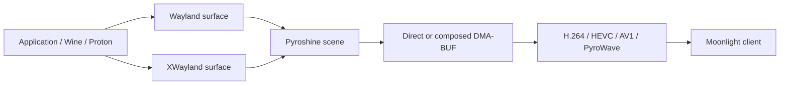

# Native presentation and HDR

Applications present through their actual Wayland or XWayland surfaces. Smithay
owns mapping, stacking, focus, buffer transactions, frame callbacks and
presentation feedback. Pyroshine captures the visible compositor scene and
exports DMA-BUFs to the existing video pipeline. It does not install or activate
a Vulkan implicit layer, substitute application surfaces or intercept Vulkan
presentation.



## Color ownership

Pyroshine advertises `wp_color_manager_v1` version 3 and
`wp_color_representation_manager_v1` version 1. Supported declarations include
parametric sRGB/BT.709, BT.2020 with ST 2084/PQ, extended linear sRGB, and the
standard Windows-scRGB and Windows-BT.2100 requests. The supported alpha
representation is premultiplied electrical RGB, identity coefficients and full
range. ICC profiles, arbitrary container primaries, arbitrary transfer powers,
HLG and straight-alpha representations are not advertised.

Descriptions are stored in Smithay's surface transaction cache. They latch
with the buffer, including synchronized subsurfaces and delayed transactions.
Unsetting a description, changing to SDR and destroying a surface clear its
HDR state. Output/preferred-description notifications follow negotiated HDR
changes on reconnect. A description on a different or hidden window cannot
provide the captured surface's metadata.

| Surface declaration | Direct exported frame | Encoder behavior |
| --- | --- | --- |
| None, sRGB or BT.709 SDR | `Srgb` | Existing SDR RGB/YUV conversion and stream signaling |
| BT.2020 + PQ | `Bt2020Pq` | RGB/YUV conversion using BT.2020; no additional PQ OETF |
| Linear sRGB / Windows-scRGB | `ScrgbLinear` | BT.709 to BT.2020 matrix, 80 cd/m² per linear unit, then PQ |

Buffer precision never selects HDR. Undeclared 10-bit and FP16 buffers are SDR.
The native encoder supports the scRGB 80-nit unit; parametric descriptions with
a different linear scale fail as unsupported. Parametric SDR supports the
standard 80-nit range/reference white. PQ is absolute and uses the stream's
203-nit reference white; alternative viewing-condition adaptation is not
implemented. Unsupported combinations fail instead of being mislabeled.

Applications can supply mastering primaries, white point, mastering minimum and
maximum luminance, MaxCLL and MaxFALL through the standard parametric creator.
These remain associated with that surface and travel in `ExportedFrame` to the
existing encoder HDR SEI/OBU and Moonlight HDR control signaling. Conventional
encoders switch SDR/HDR descriptions per frame. PyroWave retains its negotiated
output color space and explicitly converts SDR sources to PQ in an HDR session;
its control state describes those encoded output pixels. Partial
metadata uses defined color-space defaults for unspecified fields; a source
without metadata uses the encoder's existing fallback. Coordinate/luminance
units are converted to the existing HDR10 metadata representation.

### Composition and direct export

Direct capture uses the real topmost eligible compositor surface. Existing
opaque-region, surface-tree, scaling, transform, cropping, lifetime, DMA-BUF
import and scene checks still apply. SDR cursor/notification late composition
remains available. No CPU frame readback or new copy is used in production.

When the scene requires GLES composition, each texture uses its own committed
color declaration. Conversion occurs in the existing texture draw, with
programs compiled once at startup, without an additional GPU pass. An HDR
primary application produces a BT.2020/PQ composition; scRGB is converted once,
PQ textures retain their encoding, and SDR overlays are anchored to 203-nit
reference white. An SDR primary produces an SDR composition and clips HDR
highlights; this is not a perceptual tone mapper. The primary application's rendered surface tree supplies composition metadata,
including native Vulkan subsurfaces. A fullscreen opaque foreground prevents a
covered HDR application from supplying metadata. Other live HDR windows cannot
describe this composition.

The current encoder late-overlay APIs describe SDR layers only. An HDR scene
with a visible cursor/notification therefore uses color-aware compositor
composition. A clean, eligible HDR surface still exports directly. This
correctness requirement is a performance limitation for mixed-color overlays;
it does not force every frame through composition. See
[capture eligibility and Steam scene behavior](COMPOSITOR.md).

## Wine and Proton

Pyroshine exposes both the embedded compositor's `WAYLAND_DISPLAY` and ordinary
XWayland `DISPLAY`. Backend selection remains an application/runtime choice.
Do not remove `DISPLAY` globally: Steam and applications requiring X11 continue
to use normal XWayland.

Wine's Wayland driver has been enabled by default since Wine 10, while X11 takes
precedence when both displays exist. To select Wayland for an individual Wine
command, use `env -u DISPLAY wine /path/to/game.exe` as that application's
configured command. See the [upstream Wine release notes](https://github.com/wine-mirror/wine/blob/wine-10.0/ANNOUNCE.md#wayland-driver).
This selects the backend; it does not guarantee that a particular runtime/game
can declare HDR.

GE-Proton currently documents these per-game Steam launch options:

```text
PROTON_ENABLE_WAYLAND=1 PROTON_ENABLE_HDR=1 %command%
```

Both options are needed for its native Wayland HDR path. This is specifically
GE-Proton's supported mechanism, not a universal switch for every Valve Proton
release. Choose a build documenting native Wayland support and check its
[current options](https://github.com/GloriousEggroll/proton-ge-custom#options).
Pyroshine does not force these variables or change the installed runtime.

Check Steam Input with the Wayland driver. Some Proton builds (for example
proton-cachyos 11.0-20261005) set `PROTON_NO_STEAMINPUT=1` whenever
`PROTON_ENABLE_WAYLAND=1`, so a game whose Steam controller configuration
emulates a gamepad receives only the raw controller; a PlayStation controller
then does nothing in such a game while an Xbox controller still works. Current
GE-Proton keeps Steam Input when the game's Steam Input setting is enabled. For
an affected build, re-enable it per game:

```text
PROTON_ENABLE_WAYLAND=1 PROTON_ENABLE_HDR=1 PROTON_NO_STEAMINPUT=0 %command%
```

The application/runtime and Mesa's normal Wayland presentation implementation
must emit color-management requests. Mesa can translate native Vulkan color
spaces and HDR metadata to these standard requests; Pyroshine does not hook
`vkSetHdrMetadataEXT` or any other Vulkan application call. Protocol presence,
actual declarations and frame diagnostics are the evidence of HDR, not the
runtime name, Steam App ID, buffer depth or HDR launch option alone. The
[standard protocol definition](https://gitlab.freedesktop.org/wayland/wayland-protocols/-/blob/main/staging/color-management/color-management-v1.xml)
defines the color encodings and units.

XWayland applications continue rendering through their normal XWayland surface.
Legacy XWayland HDR that required Vulkan interception is intentionally
unsupported. An application without a native color declaration is captured as
SDR, even in an HDR-capable negotiated session.

## Upgrade migration

Restart the server and all running applications after upgrading. Native package
upgrades remove their former package-owned layer library/manifests; postinstall
also removes the old portable manifests in `/etc`. The portable installer
removes its old layer library and both portable manifest names. Nix no longer
exports a layer package or adds it to the graphics driver path.

For a previous manual installation, remove only Pyroshine/Moonshine's obsolete
artifacts (leave other Vulkan layers alone):

```sh
sudo rm -f /usr/lib/libmoonshine_wsi.so \
  /usr/share/vulkan/implicit_layer.d/VkLayer_moonshine_wsi.json \
  /usr/share/vulkan/implicit_layer.d/VkLayer_pyroshine_wsi.json \
  /etc/vulkan/implicit_layer.d/VkLayer_moonshine_wsi.json \
  /etc/vulkan/implicit_layer.d/VkLayer_pyroshine_wsi.json
```

Remove old activation/diagnostic variables from shell profiles, systemd
environment files, application `env` entries and launch wrappers:
`ENABLE_MOONSHINE_WSI`, `DISABLE_MOONSHINE_WSI`, `MOONSHINE_WSI_*`,
`MOONSHINE_WAYLAND_DISPLAY`, `MOONSHINE_HDR`, `MOONSHINE_LIMITER_FILE`, and any
`VK_INSTANCE_LAYERS` entry selecting `VK_LAYER_MOONSHINE_wsi`. These have no
replacement settings. Obsolete application environment entries are rejected
with a diagnostic, following the existing launch-environment validation path.
Launch units also unset inherited activation/private-display variables from
the user manager. There was no separate typed WSI configuration to migrate.

Do not retain the old Steam dynamic-FPS/HDR advertisements used by interception:
`STEAM_GAMESCOPE_DYNAMIC_FPSLIMITER` and `STEAM_GAMESCOPE_HDR_SUPPORTED` are no
longer set by Pyroshine. Ordinary Steam overlay and input integration remains.

## Runtime acceptance

Build with `cargo build --release --workspace`. Use the pinned PyroWave library
from the [contributor instructions](../CONTRIBUTING.md). The commands below run
the production session/capture/encoder path, with loopback transport. They do
not validate Moonlight decoding or a client's physical HDR display. Close an
existing Pyroshine session before using the benchmark's application unit.

Enable `MOONSHINE_LOG=moonshine_core=debug` for server color/path diagnostics and
`WAYLAND_DEBUG=1` in the test application's `env` configuration for wire events.
Keep `stream.video.log_stats = true`. Save server logs and
`journalctl --user -u moonshine-session.service` while the application runs.
Look for `Native Wayland color state committed`, declared primaries/transfer
function/metadata, `Content switched to HDR (BT.2020/PQ)` or scRGB, `Capture path
changed`, and direct/composited frame counters. A mode negotiated with `--hdr`
alone does not prove HDR content.

### A — SDR Wayland

```sh
target/release/moonshine-bench --codec h264 --duration 30 --warmup 4 -- \
  /usr/bin/vkcube --wsi wayland --width 1920 --height 1080
```

Repeat from Moonlight using the same application. Verify image, keyboard/mouse,
focus, cursor, resize and fullscreen. Without overlays/scaling the eligible
surface should use direct export. `--wsi wayland` here is vkcube's standard
backend selector, not a Pyroshine layer setting.

### B — SDR XWayland

Repeat A with `--wsi xcb`; also test an actual XWayland Proton game. Verify
ordinary XWayland surface presentation, correct SDR and input, direct export
when eligible, and absence of the old layer using D.

### C — native HDR

Connect an HDR-capable Moonlight/Pyrolight client using HEVC or AV1 with HDR
enabled. Launch a native Wayland HDR game or a supported Wine/Proton Wayland
game with the runtime-specific configuration above. Save its color protocol
trace and Pyroshine's committed surface/frame diagnostics.

Test PQ and FP16 scRGB sources separately with a known luminance/chromaticity
ramp. PQ must remain `Bt2020Pq` on direct export; scRGB must remain
`ScrgbLinear`. Composition normalizes HDR to PQ once. Check supplied mastering
primaries, white point, min/max luminance and MaxCLL/FALL in encoder/control
diagnostics or decoded HDR SEI/OBU; client HDR mode and measured highlights must
match. Switch HDR→SDR→HDR, alternate two games with different metadata, destroy
the HDR game, and verify there is no stale metadata or inferred HDR on an
undeclared 10-bit/FP16 source. Repeat with cursor, Steam overlays, forced
composition, HEVC/AV1/PyroWave and 4:4:4 modes supported by the client/GPU.

mpv with a tagged PQ test file is a useful server probe:

```sh
target/release/moonshine-bench --hdr --codec hevc --duration 30 --warmup 4 -- \
  mpv --no-config --no-audio --vo=gpu-next --gpu-api=vulkan \
  --gpu-context=waylandvk --target-colorspace-hint=yes \
  --target-colorspace-hint-mode=source --loop-file=inf --fullscreen /path/to/pq.mkv
```

For a scRGB probe use mpv's target mode with `--target-prim=bt.709
--target-trc=linear --target-peak=10000 --target-colorspace-hint-mode=target`;
verify the actual declaration rather than assuming the selected options worked.
Add `--composited` or `--cursor moving` to the benchmark to exercise mixed scenes.

### D — layer absence

Set `VK_LOADER_DEBUG=layer` in the application's test environment and inspect
its launch journal. No Pyroshine/Moonshine layer should appear in the loaded
layer chain. During a benchmark:

```sh
pid=$(systemctl --user show moonshine-session.service -p MainPID --value)
rg 'lib(moonshine|pyroshine)_wsi' /proc/"$pid"/maps
tr '\0' '\n' < /proc/"$pid"/environ | \
  rg 'ENABLE_MOONSHINE_WSI|MOONSHINE_WAYLAND_DISPLAY|VK_INSTANCE_LAYERS'
```

Both searches should have no matching activation/library entries. Loader
enumeration can find a leftover host installation without loading it; remove
that obsolete installation using the migration steps. Package contents must
contain neither the library nor its manifests. Inspect the actual game process
when a launcher owns the unit's main PID.

### E/F — Steam and previous failures

Through a real Moonlight session, test Steam, Steam Input/controller feedback,
a Wayland game, an XWayland game, Steam Overlay opening/closing, menu dropdowns,
notifications, keyboard/mouse/cursor and returning to Steam after game exit.
Run at least two games simultaneously, repeatedly switch focus, rapidly
launch/close/relaunch, and change resolution/fullscreen/windowed modes to force
ordinary driver swapchain recreation. Include games previously needing layer
workarounds. Run disconnect/reconnect, unchanged-mode resume and changed
resolution/HDR/codec cases from [reconnect validation](reconnect-validation.md).
Record errors, frame continuity and resource counts across repeated cycles.

### Performance and automated GPU checks

Use matching source, GPU clocks, codec/mode, warmup and duration before/after;
avoid concurrent compilation. Record CPU/RSS/fds, GPU utilization (driver tool),
latency distributions, direct/late/composited percentages, conversion timing,
DMA-BUF cache activity and dropped frames. Repeat clean, cursor and overlay
scenes separately. See [benchmarking](BENCHMARKING.md) for the normal counters;
allocator profiling and physical client latency require additional tooling.

```sh
cargo test -p moonshine-core native_color_draw -- --ignored --nocapture
cargo test -p moonshine-core invalid_native_color_constructors -- --ignored --nocapture
cargo test -p moonshine-core xwayland_tests -- --ignored --test-threads=1
MOONSHINE_TEST_GPU=1 cargo test -p moonshine-core packed_converter -- --ignored --nocapture
MOONSHINE_TEST_GPU=1 cargo test -p moonshine-core \
  gpu_import_after_source_owner_teardown_and_fd_reuse -- --ignored --nocapture
```

These include GPU color swatches (PQ identity, 80-nit scRGB, SDR reference white,
alpha), malformed-client isolation, existing conversion formats/ranges, source ownership, and real XWayland
focus/overlay/lifetime contracts. CPU tests cover committed surface state,
synchronized children, metadata isolation, HDR/SDR transitions, destruction and
undeclared high-precision buffers. Passing them does not replace the live client,
game, controller and HDR-display checks above.

For packaging checks, build the workspace first, build the pinned PyroWave
library, then run `VERSION=0.17.0 nfpm package --config nfpm.yaml
--packager deb --target /tmp/pyroshine.deb` (substitute the workspace version;
repeat for `rpm` and `archlinux`). Inspect the payloads with `bsdtar`; neither a
custom Vulkan library nor an implicit-layer manifest should be present. Execute
the release workflow's portable staging block and inspect that archive too.
On a Nix host, run `nix build .#moonshine` and inspect `result/`; evaluate a NixOS
configuration with the module enabled to check the driver path and service.
